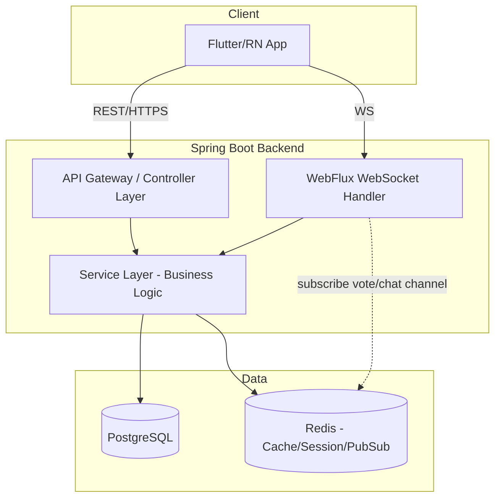
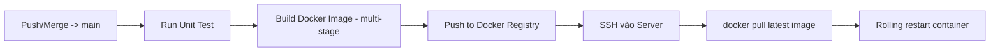
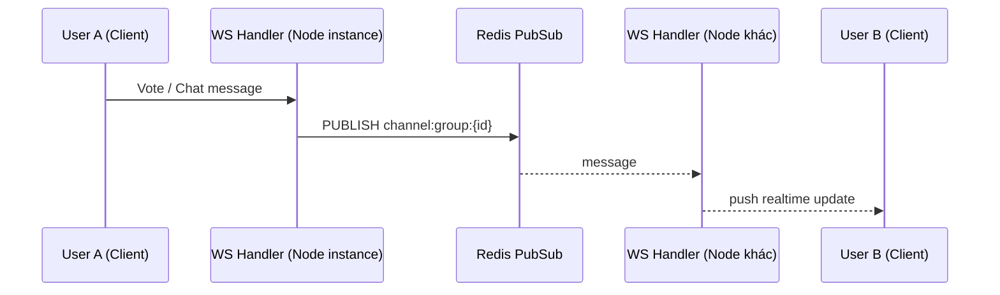

# Kube Social — Technical Architecture

## 1. Stack
| Layer | Công nghệ |
|---|---|
| Frontend | Flutter / React Native (cross-platform) |
| Backend | Java 17+, Spring Boot, Spring WebFlux (WS realtime) |
| DB | PostgreSQL (chính), Redis (cache/session/pub-sub realtime) |
| Container | Docker (multi-stage build) |
| CI/CD | GitHub Actions |
| Infra | Docker Compose (local/staging), VPS/Cloud SSH deploy (prod v1) |

## 2. High-level Architecture

## 3. Deployment / CI-CD Flow

Quy ước file:
- `Dockerfile` (multi-stage: build jar bằng maven/gradle image -> copy sang JRE-slim image)
- `docker-compose.yml`: services `backend`, `postgres`, `redis` (local/staging)
- `.github/workflows/ci-cd.yml`: job `test` -> `build-push` -> `deploy`
- Biến môi trường (DB_URL, REDIS_URL, JWT_SECRET...) đưa vào GitHub Secrets + `.env` (không hardcode).

## 4. Realtime Mechanism (Vote & Chat)

Lý do dùng Redis PubSub: đảm bảo broadcast đúng khi backend scale nhiều instance (horizontal scaling), không dùng in-memory session list.
