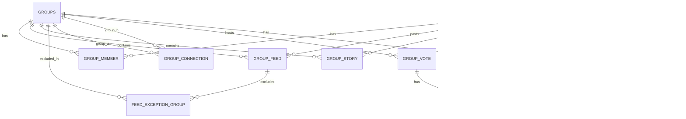

# Kube Social — Database Schema (PostgreSQL)

## 1. ERD

## 2. Bảng chi tiết

### users
| Field | Type | Note |
|---|---|---|
| id | UUID PK | |
| username | varchar unique | |
| email | varchar unique | |
| password_hash | varchar | |
| created_at | timestamp | |

### groups
| Field | Type | Note |
|---|---|---|
| id | UUID PK | |
| name | varchar | |
| avatar_url | varchar | |
| privacy_mode | enum(PRIVATE, PUBLIC, ONLY_PRIVACY) | mặc định PRIVATE |
| owner_id | FK users | admin gốc |
| friend_request_link | varchar unique | chỉ hiện với member khi ONLY_PRIVACY |
| created_at | timestamp | |

### group_member
| Field | Type | Note |
|---|---|---|
| id | UUID PK | |
| group_id | FK groups | |
| user_id | FK users | |
| role | enum(ADMIN, MEMBER) | |
| muted_until | timestamp nullable | ban đăng bài tạm/vĩnh viễn |
| joined_at | timestamp | |
| unique(group_id, user_id) | | |

### group_feed
| Field | Type | Note |
|---|---|---|
| id | UUID PK | |
| group_id | FK groups | |
| user_id | FK users (poster) | |
| media_url | varchar | |
| media_type | enum(IMAGE, VIDEO) | |
| visibility_mode | enum(PRIVATE, PUBLIC, EXCEPT) | override theo group nhưng có thể set riêng từng post |
| created_at | timestamp | |
| index(group_id, created_at) | | tối ưu feed query |

### feed_exception_group
| Field | Type | Note |
|---|---|---|
| feed_id | FK group_feed | |
| excluded_group_id | FK groups | dùng khi visibility_mode = EXCEPT |
| PK(feed_id, excluded_group_id) | | |

### group_story
| Field | Type | Note |
|---|---|---|
| id | UUID PK | |
| group_id | FK groups | |
| user_id | FK users | |
| media_url | varchar | |
| expires_at | timestamp | TTL 24h, dùng Redis TTL key hoặc scheduled job cleanup |
| created_at | timestamp | |

### group_connection ("Group Quen")
| Field | Type | Note |
|---|---|---|
| id | UUID PK | |
| group_a_id | FK groups | nhóm phát lệnh |
| group_b_id | FK groups | nhóm nhận lệnh |
| status | enum(PENDING, ACTIVE, REJECTED) | |
| created_at | timestamp | |
| unique(group_a_id, group_b_id) | | |

### group_vote
| Field | Type | Note |
|---|---|---|
| id | UUID PK | |
| group_id | FK groups | nơi diễn ra vote |
| initiated_by_user_id | FK users | |
| vote_type | enum(BAN_MEMBER, GROUP_CONNECTION) | |
| target_user_id | FK users nullable | dùng khi BAN_MEMBER (có thể là admin) |
| target_group_id | FK groups nullable | dùng khi GROUP_CONNECTION |
| threshold_percent | int | BAN_MEMBER=50, GROUP_CONNECTION=80 |
| ban_duration | interval nullable | nếu vote ban thắng |
| start_at / end_at | timestamp | |
| status | enum(OPEN, PASSED, FAILED) | |

### vote_ballot
| Field | Type | Note |
|---|---|---|
| id | UUID PK | |
| vote_id | FK group_vote | |
| user_id | FK users | |
| choice | enum(AGREE, DISAGREE) | |
| voted_at | timestamp | |
| unique(vote_id, user_id) | | mỗi member 1 phiếu |

### reaction
| Field | Type | Note |
|---|---|---|
| id | UUID PK | |
| target_type | enum(FEED, STORY) | |
| target_id | UUID | |
| user_id | FK users | |
| emoji_type | varchar | |
| unique(target_type, target_id, user_id) | | |

### comment
| Field | Type | Note |
|---|---|---|
| id | UUID PK | |
| target_type | enum(FEED, STORY) | story comment thực chất route vào chat |
| target_id | UUID | |
| group_id | FK groups | |
| user_id | FK users | |
| content | text | |
| created_at | timestamp | |

### group_chat_message
| Field | Type | Note |
|---|---|---|
| id | UUID PK | |
| group_id | FK groups | |
| user_id | FK users | |
| message_type | enum(TEXT, STORY_COMMENT_REF) | |
| ref_story_id | FK group_story nullable | |
| content | text | |
| created_at | timestamp | |

## 3. Ghi chú tối ưu
- Redis: cache `group_feed` list theo `group_id` (invalidate on new post), cache tỉ lệ % vote realtime (key `vote:{id}:agree_count`), TTL key cho story thay vì cron nếu cần realtime disappear.
- Index bắt buộc: `group_member(group_id, user_id)`, `group_feed(group_id, created_at desc)`, `vote_ballot(vote_id)`.
