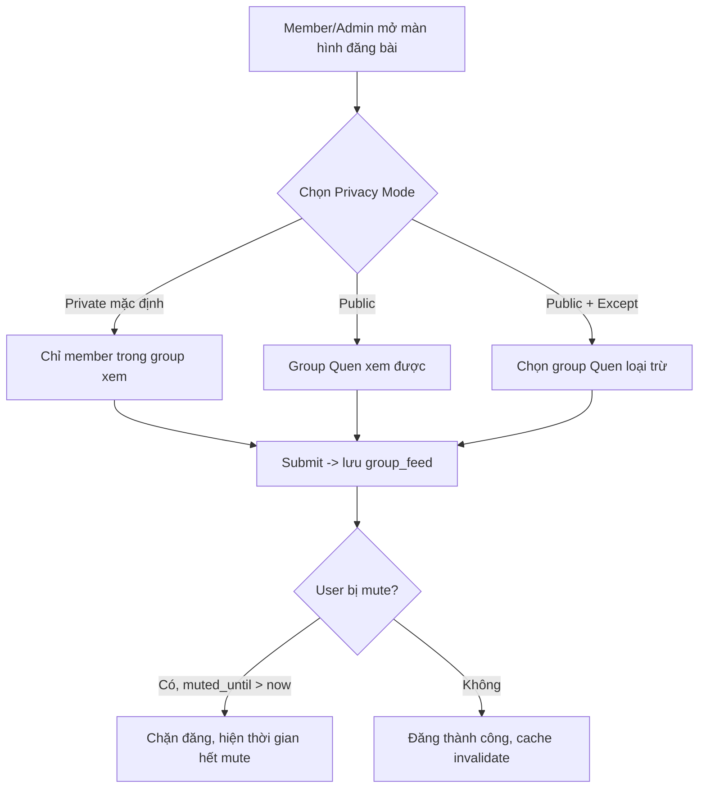
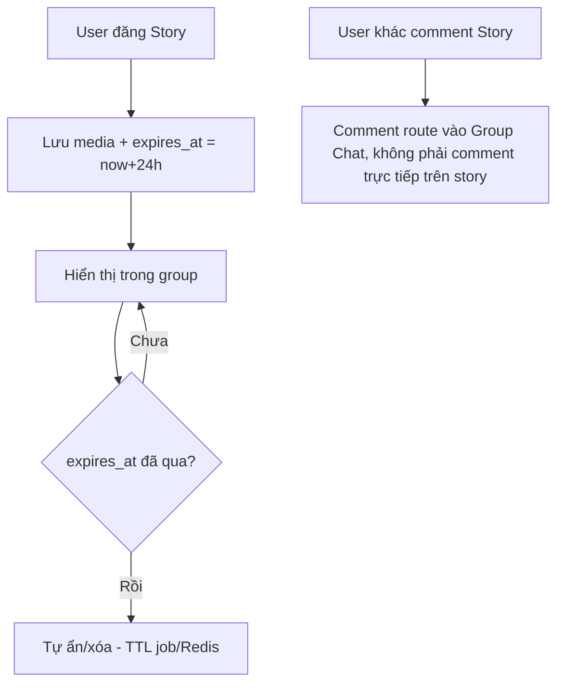
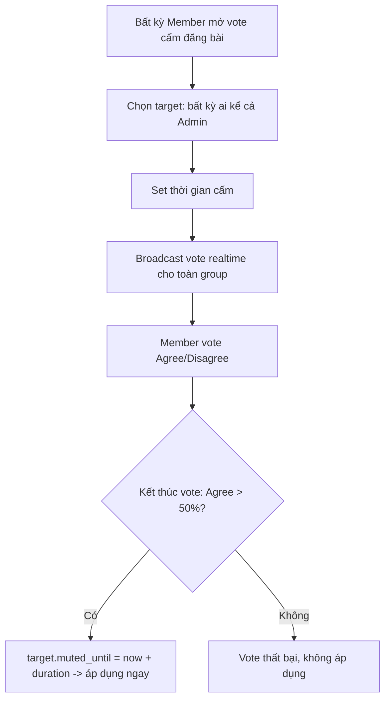
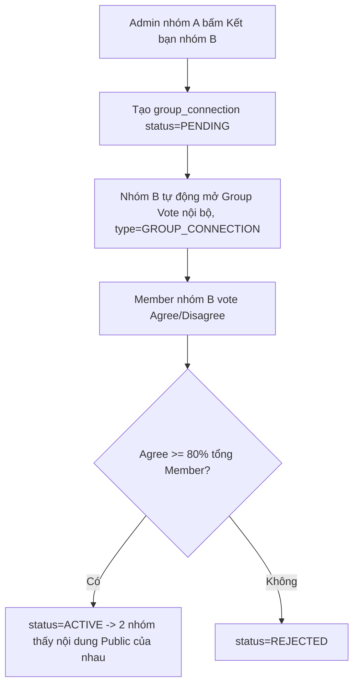
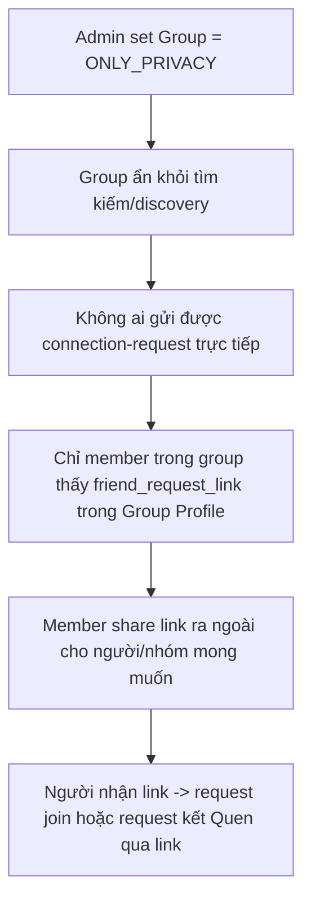
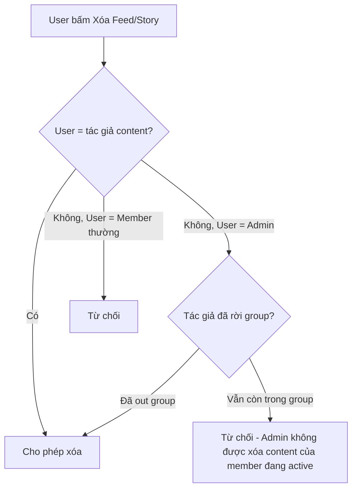

# Kube Social — User Flows

## 1. Đăng nội dung Feed với Privacy Mode

## 2. Group Story (TTL 24h)

## 3. Vote cấm đăng bài (bảo vệ Member trước Admin)

## 4. Group Connection ("Group Quen")

## 5. Only Privacy Group Mode

## 6. Phân quyền xóa content (Edge-case quan trọng)

